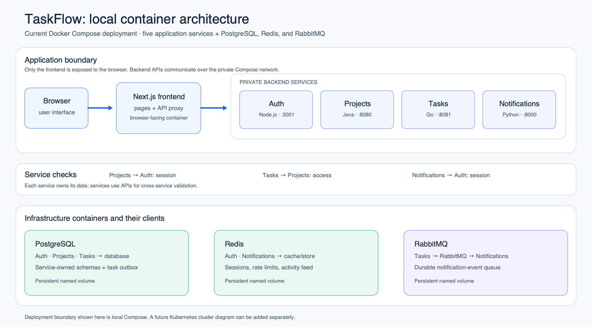
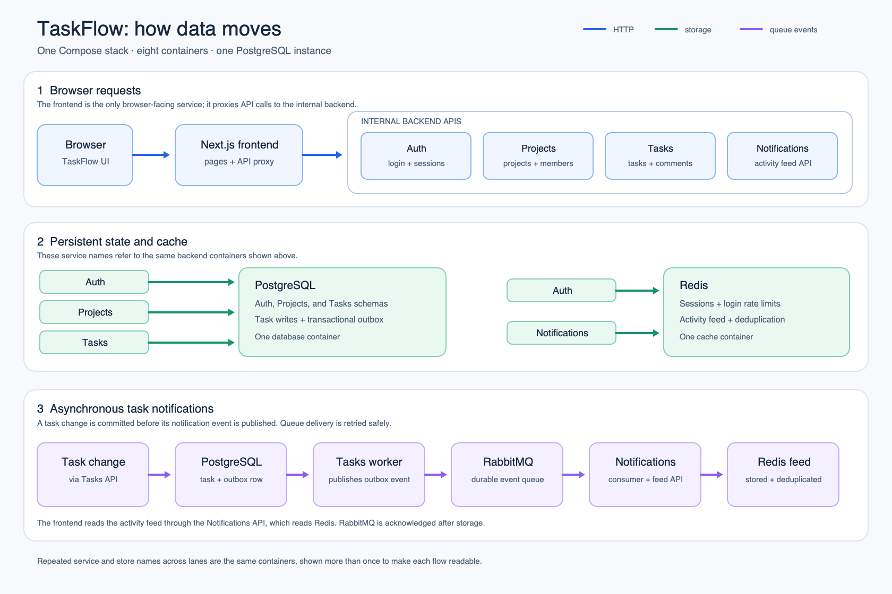

# TaskFlow

A local team task workspace built with five services in four backend languages. **Milestones 1–4:** register or sign in, create shared projects, manage members, assign and discuss tasks, track progress, receive durable notifications, run the stack with tested container security controls, and validate tested/scanned container artifacts in CI. One Docker Compose command runs the application, PostgreSQL, Redis, and RabbitMQ.

## Architecture diagrams

The diagrams below describe the current local Docker Compose setup. A Kubernetes cluster diagram can be added here separately when that deployment is designed.

### Container architecture



### Application data flow



The [Kubernetes resources](deploy/kubernetes/README.md) provide a separate Deployment and Service file for each of the eight components, plus configuration, secrets, persistent storage, and ingress. Apply the plain YAML with `kubectl apply -f deploy/kubernetes/` after completing the documented setup. The diagrams above show the Compose setup.

## Run locally

Prerequisites: Docker Desktop (or Docker Engine with Compose v2.20+), a running Docker daemon, and OpenSSL for generating local configuration. Allocate roughly 4 GB of memory to Docker. You do not need Java, Go, Python, or Node installed to run the application.

```sh
./scripts/setup.sh
docker compose up --build --wait
```

Open **http://localhost:3000**. Sign in with:

- Email: `alex@taskflow.local`
- Password: `taskflow-local-demo`

The default demo project is **Platform launch**. Create a task, select its status, and open Activity to see its notification. You can also create a project, search tasks in the current project, and track completion above the board. The responsive sign-in and workspace include light and dark modes, use the device theme on first visit, remember an explicit choice, and provide keyboard focus states and reduced-motion support. First builds download several language runtimes and take longer than subsequent starts.

`setup.sh` creates a git-ignored `.env` with random database and internal API credentials and preserves existing configuration. Alternatively, copy `.env.example` to `.env` and supply your own values. Keep `POSTGRES_PASSWORD` URL-safe because it is used in connection URLs. Set `FRONTEND_PORT` if port 3000 is occupied. If you customize the demo email/password, enter your configured values in the sign-in form. The form's sample credentials stay at their defaults.

The frontend, PostgreSQL development port, and RabbitMQ management console are bound only to `127.0.0.1`; application backends, Redis, and RabbitMQ's AMQP port remain private to Compose. This setup is for local development, not an Internet deployment.

## Check and stop

```sh
docker compose ps
python3 scripts/smoke.py
python3 scripts/milestone2_smoke.py
docker compose exec -T auth-service node --input-type=module < scripts/check-isolation.mjs
python3 scripts/verify_container_policy.py
docker compose logs --tail=100 -f
# Stop services while keeping data:
docker compose down
# Start the existing images again:
docker compose up --wait
```

The smoke check needs Python 3 on the host. It checks liveness/readiness, login/logout, httpOnly cookies, unauthenticated access, cross-origin write rejection, project creation, task creation/status changes, and notification delivery. It deliberately leaves a clearly named smoke project/task so persistence can be inspected. For a custom port, run `TASKFLOW_URL=http://localhost:YOUR_PORT python3 scripts/smoke.py`. Pass `DEMO_EMAIL` and `DEMO_PASSWORD` as environment variables if changed.

PostgreSQL, Redis, and RabbitMQ use named volumes. `docker compose down` preserves them. **`docker compose down --volumes` permanently deletes this project's local data**, including sessions and queued messages. If you change the database or RabbitMQ password after the first start, also update the existing service credentials or intentionally reset the volumes; initialization settings do not update existing data volumes.

## Repository

```text
taskflow/
├── frontend/                 Next.js + TypeScript UI and same-origin API proxy
├── auth-service/             Node.js + TypeScript, password check and sessions
├── project-service/          Java + Spring Boot, owned projects
├── task-service/             Go, tasks and project-ownership checks
├── notification-service/     Python + FastAPI, notification ingestion and feed
├── scripts/                  Local setup and end-to-end smoke check
├── docs/                     API contract, architecture, scope and verification
├── docker-compose.yml        All eight local services and persistent volumes
└── .env.example              Documented local configuration
```

Each service has its own dependencies, lock/version declarations, Dockerfile, runtime configuration, and health checks. Every image build runs focused tests; the frontend also runs API-boundary tests, type checking, and a production build. There is no shared backend code package or hidden dependency on host language runtimes.

## Service boundaries

| Service | Internal port | Responsibilities | Data |
| --- | --- | --- | --- |
| Frontend | 3000 | Workspace, forms, same-origin API routes | httpOnly session cookie |
| Auth | 3001 | Demo sign-in, session lookup/revocation | PostgreSQL `auth` schema; Redis sessions |
| Projects | 8080 | Create/list/get owned projects | PostgreSQL `projects` schema |
| Tasks | 8081 | Create/list/update task status | PostgreSQL `tasks` schema |
| Notifications | 8000 | Accept internal events, return current user's feed | Redis lists and deduplication keys |
| PostgreSQL | 5432 | Persistent application records | Named volume |
| Redis | 6379 | Expiring sessions and notification feeds | Named volume, append-only persistence |
| RabbitMQ | 5672 | Durable task-event delivery | Named volume; management UI on localhost:15672 |

Every app service exposes `/health` for liveness and `/ready` for dependency readiness. Compose waits for readiness before starting dependents. The browser calls only the frontend. Backend URLs and bearer tokens stay server-side. Auth owns the user identity; projects enforce owner access; tasks check access through the project service. Task changes commit notification events to a PostgreSQL outbox, publish them to RabbitMQ, and the notification service consumes them into Redis. See [architecture](docs/architecture.md) and [API contract](docs/api-contract.md).

## Development and tests

Docker builds compile each app and run its focused tests. Rebuild and run the complete local Milestone 3 verification after code changes:

```sh
./scripts/verify_milestone3.sh
```

Docker Scout can generate an SPDX SBOM and SARIF vulnerability report for every application image, then fail if any high or critical vulnerability is present:

```sh
./scripts/scan_images.sh
```

Reports are written under the git-ignored `artifacts/security/` directory. Docker Scout is included with current Docker Desktop releases and can also be installed as a Docker CLI plugin.

Individual checks with the appropriate runtimes installed:

```sh
(cd auth-service && npm ci && npm run build && npm test)
(cd frontend && npm ci && npm test && npm run typecheck && npm run build)
(cd project-service && mvn test)
(cd task-service && go test ./...)
(cd notification-service && python3.13 -m venv .venv && .venv/bin/pip install --require-hashes -r requirements.txt && .venv/bin/python -m unittest discover -s tests -v)
```

Recorded results are in [the verification notes](docs/verification.md). See each service's package/build manifest for runtime versions. Native runs require the service environment variables in [the API contract](docs/api-contract.md) and reachable backing services; Compose is the supported, fully wired local path.

GitHub Actions runs language-specific checks, Semgrep SAST, Trivy repository and image gates, SPDX SBOM generation, and full-stack integration against the exact scanned images. It does not publish or deploy artifacts. See [continuous integration](docs/continuous-integration.md) for the pipeline, reports, optional SonarQube settings, and recommended required checks.

For startup problems, inspect `docker compose ps` and the failing service's logs. Verify Docker is running, `.env` exists, and your selected frontend port is free. A backend outage produces a failed readiness check and a visible error in the UI; health does not pretend the dependency is available.

## Deliberate Milestone 4 limits

This is a working development foundation with production-oriented structure, not a production deployment. It supports registration, signed and revocable 24-hour JWT sessions, team membership, project editing/archival, complete task CRUD, assignments, comments, pagination, and activity feeds. Password reset, email verification, invitations for unregistered users, ownership transfer, and fine-grained roles are outside this milestone. Notification feeds retain the latest 100 entries and expire after seven days without new events.

Schemas belong to individual services but use one local database role. All PostgreSQL services use versioned, transactional migrations that preserve Milestone 1 data. Task mutations and notification events commit atomically to a PostgreSQL outbox; a retrying worker publishes durably to RabbitMQ, and Redis deduplicates stable event IDs after consumption. Application containers run as non-root users with read-only roots, dropped capabilities, bounded CPU/memory/process counts, private backend networking, and graceful shutdown periods. Production work still includes TLS, managed secrets, per-service database roles, backups, account recovery/verification, outbox retention, and deployment-specific rate limiting. See [container hardening](docs/container-hardening.md) for the enforced policy and documented infrastructure exceptions.

Dependency lockfiles and explicit runtime versions keep dependency versions consistent; PostgreSQL, Redis, and RabbitMQ images are pinned by digest. Maintain those pins and application dependencies together as security updates become available. No cloud infrastructure or external notification provider is provisioned by this repository.

The CI pipeline validates application images but does not publish them or deploy infrastructure. The Kubernetes files are an untested deployment starting point; cluster provisioning and production validation remain separate work.
