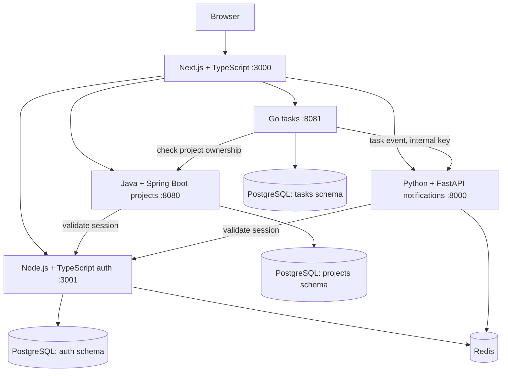

# Milestone 1 architecture

The three database nodes represent service-owned schemas in one local PostgreSQL instance. Services do not query each other's tables. The Next.js API layer is a small browser-facing proxy, not a separate gateway deployment. Its explicit route allowlist keeps private service URLs and credentials outside the browser.

## Request flow

1. A sign-in request reaches auth through the frontend. Auth verifies a salted scrypt password hash and creates a random, 24-hour Redis session. Redis stores only a hash of the opaque bearer token as the key.
2. The frontend stores the token in an httpOnly, SameSite=Lax cookie and returns the public user. Mutating browser requests must have a matching origin. Local HTTP cookies are not marked Secure; set the frontend option when adding HTTPS.
3. Projects validate the token with auth and scope all repository operations to that owner. Tasks resolve project access through the project service before returning or changing records.
4. A task write is committed to PostgreSQL. The task service sends an event to notifications using the internal API key. Failure is logged and does not reverse the task write.
5. Notifications atomically deduplicate the event ID and prepend it to the user's capped Redis feed. The user's feed API validates their session with auth.

## Operational boundaries

Each app runs one foreground process per container with a non-root identity, minimal runtime artifact set, configuration from the environment, and shutdown handling. Go ships a compiled executable; Java ships its application JAR on a JRE; the frontend ships Next.js standalone output; auth ships compiled JavaScript and production packages; notifications ship Python and installed runtime packages. Build tools and tests stay in build stages.

`/health` answers whether the process can respond. `/ready` also probes required dependencies; Docker healthchecks use readiness. Startup ordering reduces dependency races; timeouts and safe error responses handle later failures. Compose restarts crashed processes, but does not restart merely unhealthy containers. Investigate logs rather than assuming a green process means its dependencies work.

The local network is private to Compose by default, with only localhost:3000 published. Redis has no public port and serves this development stack only. All schemas share one database role in this milestone. The static demo identity, fixed sign-in defaults, and local HTTP transport are explicit development choices.
